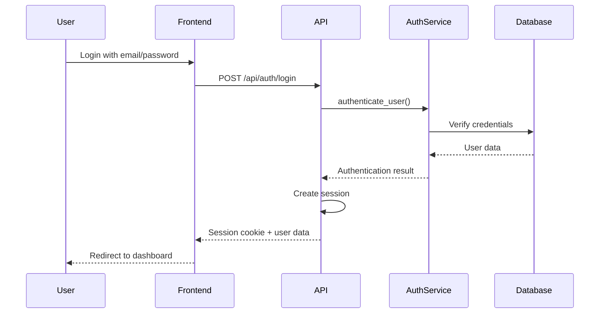
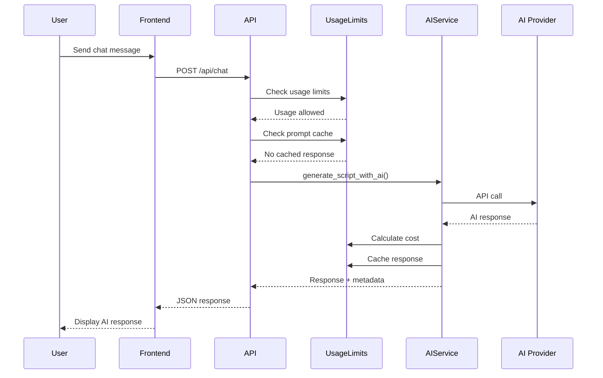
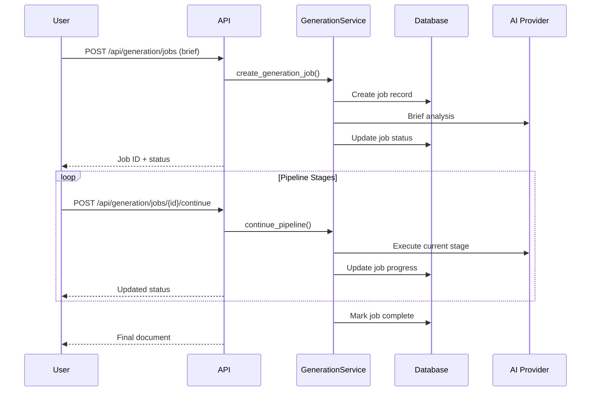

# System Architecture Guide (Prompt 30)

This document provides a comprehensive overview of the Internal Platform system architecture, including all components, services, data flow, and integration points implemented through Prompts 19-30.

## System Overview

The Internal Platform is a comprehensive video content management and AI-powered analysis system built with a modern, scalable architecture. The system handles video transcription, AI-powered content generation, user management, and provides extensive monitoring and optimization capabilities.

### High-Level Architecture

```
┌─────────────────────────────────────────────────────────────────┐
│                        Users & External Clients                  │
└─────────────────────────────┬───────────────────────────────────┘
                              │
┌─────────────────────────────▼───────────────────────────────────┐
│                       Load Balancer (nginx)                      │
└─────────────────────────────┬───────────────────────────────────┘
                              │
┌─────────────────────────────▼───────────────────────────────────┐
│                      React Frontend (Port 3000)                  │
│  ┌─────────────────┐ ┌─────────────────┐ ┌─────────────────┐   │
│  │ Authentication  │ │ Content Library │ │ AI Interface    │   │
│  │ Components      │ │ Management      │ │ Chat & Generate │   │
│  └─────────────────┘ └─────────────────┘ └─────────────────┘   │
└─────────────────────────────┬───────────────────────────────────┘
                              │ API Calls
┌─────────────────────────────▼───────────────────────────────────┐
│                     Flask API Server (Port 5001)                 │
│  ┌─────────────────┐ ┌─────────────────┐ ┌─────────────────┐   │
│  │ Authentication  │ │ Content APIs    │ │ AI Integration  │   │
│  │ & Session Mgmt  │ │ CRUD Operations │ │ Chat & Pipeline │   │
│  └─────────────────┘ └─────────────────┘ └─────────────────┘   │
│  ┌─────────────────┐ ┌─────────────────┐ ┌─────────────────┐   │
│  │ Health Checks   │ │ Usage Tracking  │ │ Pipeline Mgmt   │   │
│  │ Smoke Tests     │ │ Cost Control    │ │ Generation Jobs │   │
│  └─────────────────┘ └─────────────────┘ └─────────────────┘   │
└─────────────────────────────┬───────────────────────────────────┘
                              │
┌─────────────────────────────▼───────────────────────────────────┐
│                         Service Layer                            │
│  ┌─────────────────┐ ┌─────────────────┐ ┌─────────────────┐   │
│  │ Auth Service    │ │ AI Service      │ │ Generation      │   │
│  │ 2FA & Sessions  │ │ Claude/OpenAI   │ │ Pipeline        │   │
│  └─────────────────┘ └─────────────────┘ └─────────────────┘   │
│  ┌─────────────────┐ ┌─────────────────┐ ┌─────────────────┐   │
│  │ Usage Limits    │ │ External        │ │ Monitoring      │   │
│  │ Cost Tracking   │ │ Content Service │ │ Service         │   │
│  └─────────────────┘ └─────────────────┘ └─────────────────┘   │
└─────────────────────────────┬───────────────────────────────────┘
                              │
┌─────────────────────────────▼───────────────────────────────────┐
│                        Data Layer                               │
│  ┌─────────────────┐ ┌─────────────────┐ ┌─────────────────┐   │
│  │ PostgreSQL RDS  │ │ S3 Storage      │ │ Metrics DB      │   │
│  │ User Data       │ │ Video Files     │ │ SQLite Local    │   │
│  │ Conversations   │ │ Transcripts     │ │ Performance     │   │
│  │ AI Logs         │ │ Generated Docs  │ │ Health Data     │   │
│  └─────────────────┘ └─────────────────┘ └─────────────────┘   │
└─────────────────────────────┬───────────────────────────────────┘
                              │
┌─────────────────────────────▼───────────────────────────────────┐
│                    Infrastructure & Operations                   │
│  ┌─────────────────┐ ┌─────────────────┐ ┌─────────────────┐   │
│  │ AWS EC2         │ │ CI/CD Pipeline  │ │ Monitoring &    │   │
│  │ Application     │ │ GitHub Actions  │ │ Alerting        │   │
│  │ Hosting         │ │ Automated Tests │ │ Slack/Email     │   │
│  └─────────────────┘ └─────────────────┘ └─────────────────┘   │
│  ┌─────────────────┐ ┌─────────────────┐ ┌─────────────────┐   │
│  │ Blue-Green      │ │ AWS Cost        │ │ Health Checks   │   │
│  │ Deployments     │ │ Optimization    │ │ Smoke Tests     │   │
│  └─────────────────┘ └─────────────────┘ └─────────────────┘   │
└─────────────────────────────────────────────────────────────────┘
```

## Core Components

### Frontend Layer (React Application)

**Location**: `/frontend/src/`

**Key Components**:
- **Authentication System** - Login, registration, 2FA setup
- **Content Library** - Video/audio file management and browsing
- **AI Chat Interface** - Real-time chat with AI models
- **Dashboard** - Usage metrics and system health
- **Settings & Profile** - User account management

**Key Features**:
- React 19 with TypeScript
- Component-based architecture
- Session-based authentication
- Responsive design with Tailwind CSS
- Comprehensive test coverage with Jest

### API Layer (Flask Application)

**Location**: `/web/app.py`

**Core Endpoints**:
- **Authentication APIs** (`/api/auth/*`) - Login, registration, 2FA
- **Chat APIs** (`/api/chat`) - AI conversation handling
- **Content APIs** (`/api/external-content/*`) - CRUD operations
- **Health APIs** (`/api/health`) - System health monitoring
- **Usage APIs** (`/api/usage/*`) - Token and cost tracking
- **Generation APIs** (`/api/generation/*`) - Long-form content pipeline

**Key Features**:
- RESTful API design
- Session-based authentication with Flask sessions
- Comprehensive error handling and validation
- Rate limiting and usage tracking
- Health monitoring integration

### Service Layer

#### Authentication Service
**File**: `web/services/auth_service.py`

**Features**:
- User registration and login
- TOTP-based 2FA with backup codes
- Demo mode for testing
- Session management
- Email verification (planned)

#### AI Service
**File**: `web/services/ai_service.py`

**Features**:
- Multi-model support (Claude, OpenAI)
- Usage tracking and cost calculation
- Prompt caching for cost optimization
- Rate limiting integration
- Error handling and fallbacks

#### Usage Limits Service
**File**: `scripts/usage_limits_service.py`

**Features**:
- Token limit enforcement (50K context, 500K daily)
- Cost calculation and tracking
- Prompt caching
- Usage analytics
- Warning systems

#### Generation Service
**File**: `scripts/generation_service.py`

**Features**:
- 6-stage content generation pipeline
- Outline creation and consistency documentation
- Sectional generation with style guides
- Quality checks and assembly
- Progress tracking

#### External Content Service
**File**: `services/external_content_service.py`

**Features**:
- File upload and management
- Video/audio processing
- Metadata extraction
- Search and filtering
- Access control

#### Monitoring Service
**File**: `scripts/monitoring_service.py`

**Features**:
- Real-time metrics collection
- Performance monitoring
- Intelligent alerting
- Health check coordination
- Dashboard data generation

### Database Layer

#### PostgreSQL (Primary Database)
**Models**: `scripts/db.py`

**Key Tables**:
- **Users** - User accounts and authentication data
- **Conversations** - Chat conversations and message history
- **AILog** - AI API call tracking with cost data
- **ExternalContent** - Uploaded files and metadata
- **GenerationJob** - Long-form content generation state
- **AIPromptCache** - Cached AI responses

#### SQLite (Metrics Database)
**Purpose**: Local metrics and monitoring data storage

**Key Tables**:
- **metrics** - Time-series performance data
- **alerts** - Alert history and status

#### S3 Storage
**Purpose**: File storage for uploads and generated content

**Buckets**:
- Video/audio files
- Generated documents
- Deployment backups
- Log archives

## Data Flow

### Authentication Flow



### AI Chat Flow



### Content Generation Pipeline



## Infrastructure

### AWS Architecture

**EC2 Instance**:
- Application hosting
- Ubuntu 20.04 LTS
- nginx reverse proxy
- systemd service management

**RDS PostgreSQL**:
- Primary database
- Automated backups
- Performance monitoring

**S3 Storage**:
- File storage
- Lifecycle policies
- Cost optimization

**CloudWatch**:
- Log aggregation
- Metrics collection
- Alerting integration

### Deployment Architecture

**Blue-Green Deployment**:
1. **Blue Environment** - Current production
2. **Green Environment** - New deployment
3. **Load Balancer Switch** - Zero-downtime transition
4. **Health Verification** - Automated checks
5. **Rollback Capability** - Immediate fallback

**Direct Deployment**:
- Suitable for staging/development
- Backup and restore capability
- Health check validation

### Monitoring and Observability

**System Metrics**:
- CPU, memory, disk utilization
- Network I/O and connection counts
- Load averages and process counts

**Application Metrics**:
- Response times and error rates
- Database connection health
- API usage and costs

**Business Metrics**:
- User activity and sessions
- AI API usage and costs
- Feature utilization

**Alerting**:
- Slack integration for team notifications
- Email alerts for critical issues
- Log-based alerting for system events

## Security Architecture

### Authentication & Authorization

**Multi-Factor Authentication**:
- TOTP-based 2FA required for all users
- Backup codes for recovery
- QR code setup for authenticator apps

**Session Management**:
- Secure session cookies
- 7-day session expiry
- Session invalidation on logout

**API Security**:
- Session-based authentication
- CSRF protection
- Rate limiting

### Data Protection

**Data Encryption**:
- HTTPS for all communications
- Database encryption at rest (RDS)
- Secure S3 bucket configurations

**Access Control**:
- Role-based permissions
- Service-to-service authentication
- Environment-based access restrictions

### Security Monitoring

**Audit Logging**:
- Authentication events
- API access logs
- Administrative actions

**Security Alerts**:
- Failed authentication attempts
- Unusual access patterns
- System security events

## Performance Architecture

### Caching Strategy

**Application-Level Caching**:
- AI response caching (prompt-based)
- Session data caching
- Frequently accessed data

**Database Optimization**:
- Query optimization and indexing
- Connection pooling
- Read replicas for scaling

**CDN and Static Assets**:
- nginx static file serving
- Compression and optimization
- Browser caching headers

### Scaling Architecture

**Horizontal Scaling**:
- Load balancer distribution
- Stateless application design
- Database read replicas

**Vertical Scaling**:
- Instance size optimization
- Resource monitoring and alerting
- Auto-scaling triggers

### Performance Monitoring

**Real-time Metrics**:
- Response time tracking
- Error rate monitoring
- Resource utilization alerts

**Performance Optimization**:
- Database query analysis
- Code profiling and optimization
- AWS cost optimization

## Testing Architecture

### Test Coverage Strategy

**Frontend Testing** (Jest + React Testing Library):
- Component unit tests
- Integration tests for user flows
- API mocking for isolated testing
- Accessibility testing

**Backend Testing** (pytest):
- API endpoint testing
- Service layer testing
- Database integration testing
- Error handling validation

**End-to-End Testing**:
- Smoke tests for critical paths
- Health check validation
- Deployment verification
- Performance regression testing

### Test Automation

**CI/CD Integration**:
- GitHub Actions workflows
- Automated test execution
- Quality gates for deployments
- Test result reporting

**Test Data Management**:
- Isolated test databases
- Mock external services
- Fixture management
- Test environment provisioning

## Operational Architecture

### DevOps and CI/CD

**Version Control**:
- Git-based development workflow
- Branch protection rules
- Code review requirements
- Automated quality checks

**Continuous Integration**:
- Automated testing on PR
- Code quality analysis
- Security scanning
- Dependency validation

**Continuous Deployment**:
- Automated staging deployments
- Production deployment approvals
- Blue-green deployment strategy
- Automatic rollback capabilities

### Monitoring and Alerting

**Proactive Monitoring**:
- System health checks
- Performance baseline monitoring
- Capacity planning metrics
- Trend analysis

**Incident Response**:
- Alert escalation procedures
- Automated remediation
- Incident documentation
- Post-incident reviews

### Maintenance and Optimization

**Regular Maintenance**:
- Database maintenance windows
- Security patch management
- Dependency updates
- Performance optimization

**Cost Management**:
- AWS resource optimization
- Usage tracking and alerts
- Cost allocation and reporting
- Right-sizing recommendations

## Integration Architecture

### External Service Integrations

**AI Service Providers**:
- Anthropic Claude API
- OpenAI GPT API
- Rate limiting and cost control
- Failover and redundancy

**Communication Services**:
- Slack webhook integration
- Email service integration
- SMS notifications (planned)
- Status page integration

**Cloud Services**:
- AWS service integration
- GitHub API integration
- Monitoring service integration
- Backup service integration

### API Design

**RESTful API Principles**:
- Resource-based endpoints
- HTTP method semantics
- Status code standards
- Error response consistency

**API Versioning**:
- Version-agnostic design
- Backward compatibility
- Deprecation strategies
- Migration planning

## Disaster Recovery

### Backup Strategy

**Database Backups**:
- RDS automated backups
- Point-in-time recovery
- Cross-region backup replication
- Backup testing and validation

**Application Backups**:
- Code repository backups
- Configuration backup
- Environment state backup
- Deployment artifact retention

**File Storage Backups**:
- S3 cross-region replication
- Versioning and lifecycle policies
- Backup validation procedures
- Recovery testing

### Recovery Procedures

**Service Recovery**:
- Automated health checks
- Service restart procedures
- Failover mechanisms
- Recovery time objectives

**Data Recovery**:
- Database restore procedures
- File system recovery
- Configuration restoration
- Validation procedures

## Future Architecture Considerations

### Scalability Roadmap

**Microservices Migration**:
- Service decomposition strategy
- API gateway implementation
- Service mesh consideration
- Data consistency patterns

**Global Scaling**:
- Multi-region deployment
- CDN integration
- Regional data compliance
- Latency optimization

### Technology Evolution

**Modern Deployment**:
- Container orchestration (Kubernetes)
- Serverless functions
- Edge computing
- Progressive web app features

**Advanced Monitoring**:
- Distributed tracing
- Advanced analytics
- Machine learning-based alerting
- Automated incident response

This architecture provides a robust, scalable, and maintainable foundation for the Internal Platform while supporting future growth and technological evolution.